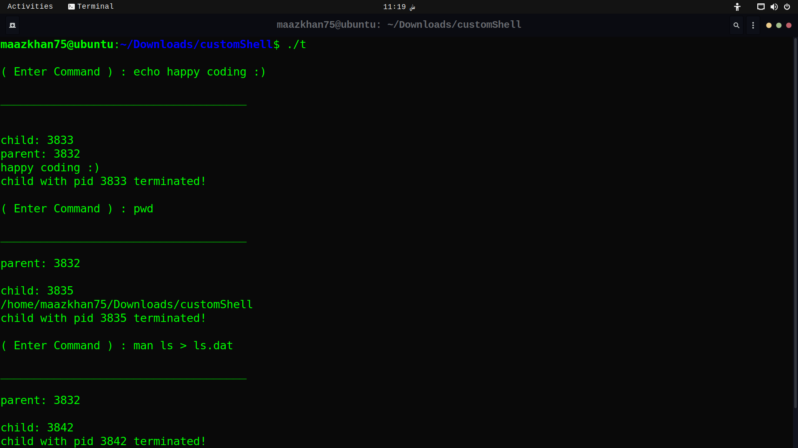
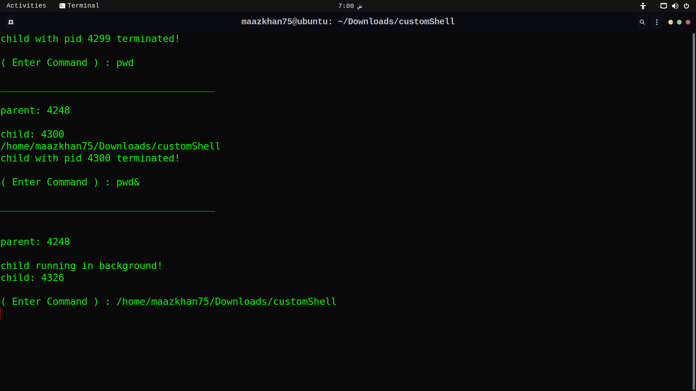
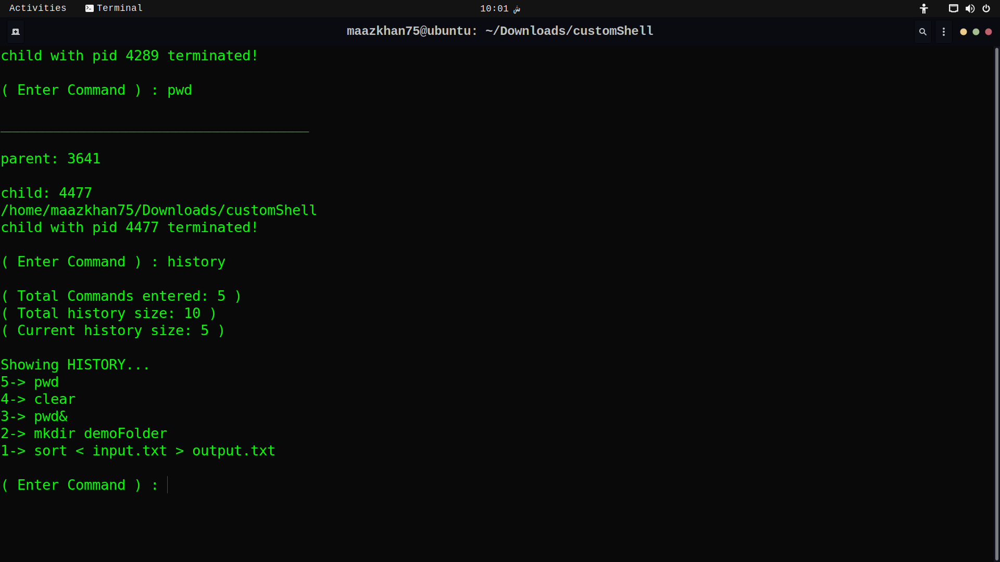
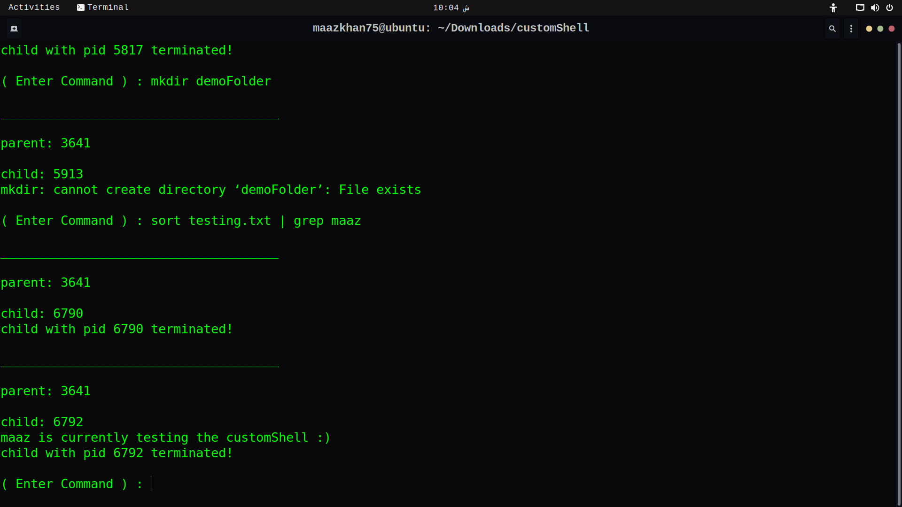

# 🚀 Custom UNIX/LINUX Shell

This is a simple custom shell implemented in C++ that supports basic Unix commands, input/output redirection, piping, and command history.

## 🌟 Features

- 📂 Execute common Unix commands like `ls`, `pwd`, `mkdir`, etc.
- 🔄 Input and output redirection using `<`, `>`, and `2>`.
- 🚰 Piping between commands using `|`.
- ⏳  Background command execution using `&`.
- 📜 Command history and recall using `!!` and `!n`.
- 🚪 Creation and usage of named pipes (FIFOs) using `mkfifo`.

## 🏁 Getting Started

### 📋 Prerequisites

- 🛠️ A C++ compiler (g++ recommended)
- 🐧🍏 Unix-like operating system (Linux, macOS)

### 🖥️ Compilation

To compile the shell, use the following command:
```bash
g++ -o custom_shell custom_shell.cpp
```

### ▶️ Running the Shell

After compiling, you can run the shell with:
```bash
./custom_shell
```

## 💡 Usage

### 📝 Basic Commands

You can run basic Unix commands like `pwd`, `ls`, `mkdir`, etc. Example:
```sh
( Enter Command ) : pwd
```

### ↪️ ↩️ Input/Output Redirection

Redirect input from a file using `<`, and output to a file using `>`. Example:
```sh
( Enter Command ) : sort < input.txt > output.txt
```

Redirect standard error using `2>`. Example:
```sh
( Enter Command ) : ls non_existent_file 2> error.txt
```

### 🔗 Piping

Use `|` to pipe the output of one command to another. Example:
```sh
( Enter Command ) : sort testing.txt | grep anyword | cat > a.txt
```

### 🔄 Background Execution

Run a command in the background using `&`. Example:
```sh
( Enter Command ) : sort testing.txt > sorted.txt &
```

### 📜 Command History

- View command history with `history`.
- Recall the most recent command with `!!`.
- Recall a specific command with `!n` (where `n` is the command number).

### 🚪 Named Pipes (FIFOs)

Create a named pipe using `mkfifo`. Example:
```sh
( Enter Command ) : mkfifo fifo1
```

Write to and read from a named pipe:
```sh
( Enter Command ) : cat fifo1&
( Enter Command ) : echo "hello" > fifo1
```

## 💻 Example Commands

- `pwd`
- `ls`
- `ls -l`
- `mkdir folderName`
- `exit`
- `&command` (e.g., `&pwd`)
- `sort < input.txt > output.txt`
- `cd directoryPath`
- `ls non_existent_file 2> error.txt`
- `man ls > ls.dat`
- `cat input.txt`
- `cat input.txt output.txt > combined.txt`
- `tr -s '[:space:]' '\n' < sortingFile.txt`
- `sort testing.txt | grep anyword | cat > a.txt`
- `sort testing.txt | grep anyword > a.txt | wc -l`
- `sort ls.dat | tee a.txt`
- `touch newFile.txt`
- `nano newFile.txt`
- `echo "coding is fun" > fifo1`
- `rm fifo1`
- `echo "code"`
- `sort testing.txt | tee a.txt`
- `sort testing.txt | tee a.txt | wc -l`
- `sort a.txt > fifo1`
- `ls | tee listing.txt | grep .cpp`

## 📝 Note on FIFOs

When writing data to a FIFO, the write will block until another process reads from it. Ensure that there is a process reading from the FIFO to avoid indefinite blocking.

## 🌍 Contributing

Contributions are welcome! Feel free to open issues or submit pull requests. 🤝

## 📄 License

This project is licensed under the MIT License. See the LICENSE file for details.

## 📥 Clone the Repository
```bash
git clone https://github.com/maazkhandev75/CustomLinuxShell.git
```

## 📸 Screenshots






